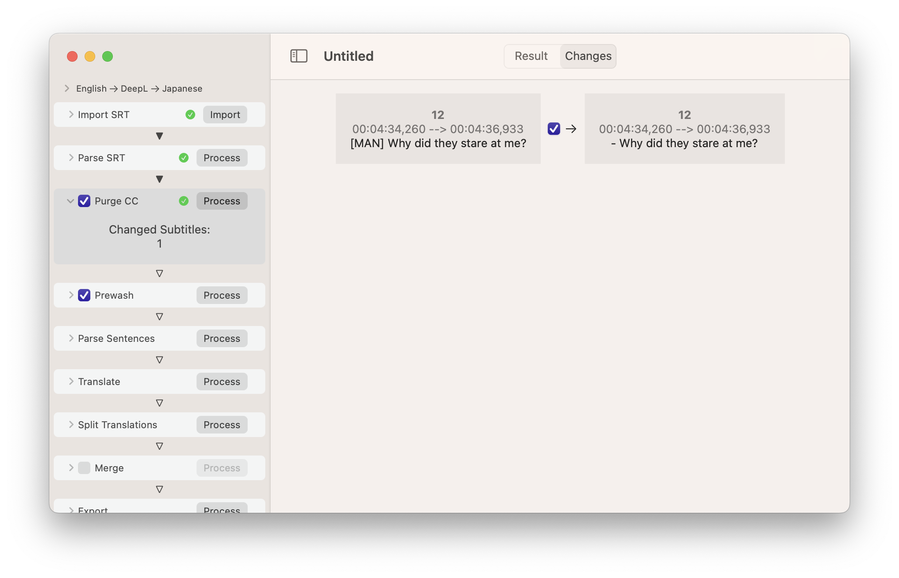

# PleasantTranslate
Better automated subtitle translation

If you need subtitles for a movie or tv show in another language than english, often you're out of luck.

One solution might be to use an automated translation service like Google Translate or DeepL to translate existing subtitles. But the formatting of common SRT subtitle files make this more or less impossible.

And this is where PleasantTranslate comes in.

### The problem
Just stuffing a SRT file into an automated translating service doesn't work. In addition to the subtitles, SRT files contain time code information, which might mess up the translation and also might get altered by the translation service. In addition to that, the written sentences are sometimes split over more than one line or even multiple subtitles (with different time codes).

Here's a short example from an SRT file:

```
12
00:04:34,260 --> 00:04:36,933
Why did they stare at me?

13
00:04:41,180 --> 00:04:45,617
If she wouldn´t have stared like that,
I would have kept running untill I had the ball.

14
00:04:47,460 --> 00:04:52,488
Or especially there, if the shoe of
the guy hit the ball the right way...

15
00:04:52,660 --> 00:04:58,610
then I would have stayed on the 
field and I could have been on the goal.
```

Subtitle #12 is the most easy one. It's a whole sentence in one line. The automated translation might get this one right by itself (as long the subtitle number and time code stay intact).

In Subtitle #13 the problems begin. There's a hard `CR` character at the end of the first line (after the `,`). Most automated translation services interpret this as "the end of the sentence". This means, that the translator tries to translate the first line separately from the second line, which usually doesn't end well.

The worst case is finally in subtitles #14 & #15. The sentence runs not only over multiple lines, but is also split up over multiple subtitles.

## The solution
PleasantTranslate tries to solve these problems by importing a SRT file, parsing its contents (to split the language from the time codes and other meta data), joining the sentences before translation and splitting the translated sentences back up after. Finally it adds the time codes and meta data back in, before writing the completed translation back in a SRT file.

### Step by step
After launching PleasantTranslate (and/or creating a new document), you'll see a window:


In the sidebar on the left, you'll find the list of processing steps. These are executed from top to down to process the subtitles. Not every step has to be processed manually. If processing is started on a later step, the previous steps are processed automatically as needed.

#### Source & Target language and Translating service
The basic settings for the project can be made above the `Import` step in the sidebar. Click on the line `English -> DeepL -> Japanese` to open the settings.


Currently it's possible to select the following languages as `Source Language`: `English`, `German`, `French`, `Swedish`, `Dutch`. (It's relatively easy to extend this list as long as the translation service and Apple's NaturalLanguage SDK support the language. See the source code or contact me for more information).

Supported translation services are currently `DeepL` and `Google Translate`. You must have at least one API Key from the chosen translation service! I strongly recommend `DeepL` as translation service.

As target language, you can currently choose between `English`, `German` and `Japanese`. As with the `Source Language`s, it's relatively easy to add more target languages (if you are a developer), as long as the language is supported by the translation service and Apple's NaturalLanguage SDK.

#### Import
Click on the `Import` step to open it's details:


You can either click on the `Import` button or drag&drop a SRT file onto the `Import` step.

After importing an SRT file, it's contents are shown on the right side of the window.


Most SRT files follow the convention to contain a 2-letter language code in their file names. E.g. `test.en.srt` (`en` for `English`). If PleasantTranslate recognizes a supported source language in the file name, it automatically adjusts the `Source Language` setting of the document (see above).

When reading the SRT file, PleasantTranslate can automatically adjust `cr` `nl` line breaks and purge any `html` tags from the subtitles (which most likely would mess up the translation). Its possible to disable both options but its recommended to leave those switches on.

#### Parse SRT
Click on the `Parse SRT` step to open its settings. Click on `Process` to parse the imported SRT file:


The parsed subtitles are displayed on the right side of the window (be sure to select `Result` in the segmented control in the window's title bar).

In case something goes wrong during parsing, the found issues can be inspected by switching the segmented control in the window's title bar from `Result` to `Issues`. For example, if the SRT file would contain some incomplete subtitle, PleasantTranslate would automatically skip the defective subtitle and generate an issue like this:


You might try to edit the original SRT file in such a case and then re-import the file.

Some SRT files contain subtitles containing advertisements at the begin or end. You can purge these from the parsed subtitles by adjusting the `Drop X Subtitles from Begining/Ending` options in the settings.

#### Purge CC
This step can remove any CC additions from the subtitles. This might be hints for "who is speaking", like `[FRANK]` or `FRANK:` in front of a sentence, additional text to describe sounds, like `(Door opening)` or song lyrics like `♪ La la la ♪`. 


These CC additions might mess up the translation. So if you do not need CC additions, it's recommended to purge them.

When you switch from `Result` to `Changes`, you can inspect every single change made by this process:



You are even able to suppress selected changes by switching the respective checkbox off.

In case you want to keep all CC additions, disable this step with the check box.

#### Prewash
To improve the quality of the later joined sentences, it might be necessary to adjust subtitles, especially when a sentence spans multiple subtitles. Often an ellipsis (`…` or `...`) is used at the end (and/or the beginning) of subtitles. 


As with `Purge CC` above, you can switch to `Changes` to inspect every single change made by this process and also suppress selected changes:


It is possible (but not recommended) to skip the whole step by switching off the checkmark.

#### Parse Sentences
This step uses Apple's NaturalLanguage SDK and some additional logic to join the split text from the subtitles back together to whole sentences.


#### Translate
This step uses an online translation service to translate the sentences, extracted from the subtitle file.

You can currently choose from two services: `DeepL` and `Google Translate`. 

**IMPORTANT: You must have a valid API key for the translation service you use!** You can get the API Keys on the websites of the services (there are free tiers available on both of them).

I recommend `DeepL`, since the quality of the translations is much better and their free tier API Key doesn't automatically switch to a paid tier.


Click on `API Key` to enter one (or more) API Key(s) for the selected translation service (the `name` field is just there to help you to keep track of the entered API Keys). The API keys are stored securely in the systems keychain and are shared between all PleasantTranslate documents on your computer.

PleasantTranslate automatically creates a glossary during translation and uses this glossary on subsequent translations of the same document. Even if a new (or edited) SRT file is imported or one of the previous steps is changed. That way, PleasantTranslate minimizes accessing the translation service as much as possible (i.e. translating the same sentence twice in the same document only will call the translation service once).

#### Split Translations
After translation, the translated sentences are needed to be split again in order to be rejoined with the respective subtitle time codes.


If a sentence was spread over multiple lines an/or subtitles, PleasantSoftware now tries to cut the translated text back into lines. It tries to cut the length of each line in the same (length) ratio as the original text, using Apple's NaturalLanguage SDK to ensure that cuts are only made at word bounds. Additional logic tries to prefer special words or punctuation for split positions, if possible.

#### Merge
In some cases, you might want to keep the original subtitles around *together* with the translation. In this case, enable the `Merge` step (which is disabled by default).
This will create multilingual subtitles:


#### Export
Finally, use the `Export` step to write the translated subtitles back to disk. Click `Process` to transform the subtitles back to their text representation, then click `Export` to choose a destination for the new SRT file.


### TL;DR
Choose a translation service and target language. Then import a SRT file and click `Process` on the last step (`Export`) to translate the SRT file. Then click `Export` to write the translated SRT file back to disk.

Have fun!